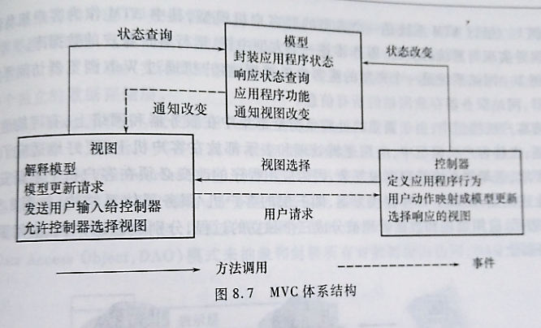
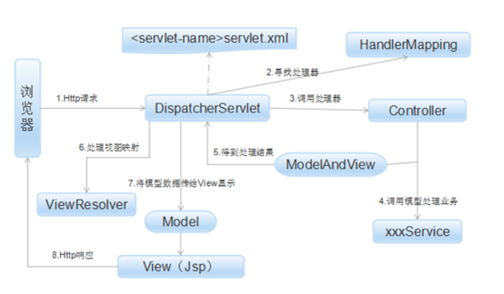
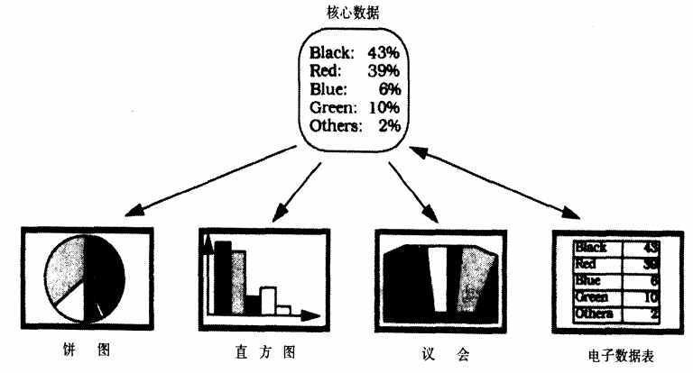

一、简介：

　　架构模式是一个通用的、可重用的解决方案，用于在给定上下文中的软件体系结构中经常出现的问题。架构模式与软件设计模式类似，但具有更广泛的范围。

　　模型-视图-控制器模式，也称为MVC模式（Model View Controller）。用一种业务逻辑、数据、界面显示分离的方法组织代码，将业务逻辑聚集到一个部件里面，在改进和个性化定制界面及用户交互的同时，不需要重新编写业务逻辑。MVC被独特的发展起来用于映射传统的输入、处理和输出功能在一个逻辑的图形化用户界面的结构中。它把软件系统分为三个基本部分：

　　　　模型（Model）：负责存储系统的中心数据。

　　　　视图（View）：将信息显示给用户（可以定义多个视图）。

　　　　控制器（Controller）：处理用户输入的信息。负责从视图读取数据，控制用户输入，并向模型发送数据，是应用程序中处理用户交互的部分。负责管理与用户交互交互控制。

　　视图和控制器共同构成了用户接口。

　　且每个视图都有一个相关的控制器组件。控制器接受输入，通常作为将鼠标移动、鼠标按钮的活动或键盘输入编码的时间。时间被翻译成模型或试图的服务器请求。用户仅仅通过控制器与系统交互。

   
   
  

二、结构

　　模型组件包含应用程序的功能内核，他封装了相应的数据并输出执行特定应用程序处理的过程；模型也提供访问数据的函数，这些数据有获得待显示的数据的视图组件使用。

　　控制器代表用户调用所有这些过程。

三、目的

　　实现一种动态的程序设计，是后序对程序的修改和扩展简化，并且使程序某一部分的重复利用称为可能。

　　通过对复杂度的简化，使程序结构更加直观。

　　将信息的内部表示与信息的呈现方式分离开来，并接受用户的请求。它分离了组件，并允许有效的代码重用。即，将模型和视图的实现代码分离，从而使同一个程序可以使用不同的表现形式。比如一批统计数据你可以分别用柱状图、饼图来表示。C存在的目的则是确保模型和视图的同步，一旦模型改变，视图应该同步更新。

四、特点

　　MVC重要特点就是两种分离：

　　视图和数据模型的分离：使用不同的视图对相同的数据进行展示；分离可视和不可视的组件，能够对模型进行独立测试。因为分离了可视组件减少了外部依赖利于测试。（数据库也是一种外部组件）

　　视图和表现逻辑(Controller)的分离：Controller是一个表现逻辑的组件，并非一个业务逻辑组件。MVC可以作为表现模式也可以作为建构模式，意味这Controller也可以是业务逻辑。分离逻辑和具体展示，能够对逻辑进行独立测试。

　　优点：耦合性低；重用性高；生命周期成本低；部署块；可维护性高；有利软件工程化管理。

　　缺点：没有明确的定义；不适合小型，中等规模的应用程序；增加系统结构和实现的复用性；视图与控制器间的过于紧密的连接；视图对模型数据的低效率访问；一般高级的界面工具或构造器不支持模式。

五、特定环境

　　大的项目；需要划分模块的项目。

六、解决的问题

　　因为在PHP还不支持面向对象之前，是过程化的方式来创建的，它们将 Model View Controller 三层的代码混在一起，十分混乱。所以它解决的问题有：维护难，开发速度慢，二次开发难度高，工作量大，代码复用，耦合度高，系统不灵活。

七、解决方案

　　以我的理解，将项目模块化，分为三个部分：模型，视图和控制器三个部分。模型是应用对象，没有用户界面。视图表示它在屏幕上的显示，代表流向用户的数据。控制器定义用户界面对用户输入的响应方式，负责把用户的动作转成针对Model的操作。Model 通过更新View的数据来反映数据的变化。

八、实例

　　应用于基于MVC架构模式的框架，常见的服务器端MVC框架有：Struts、Spring MVC、ASP.NET MVC、Zend Framework、JSF；常见前端MVC框架：angularjs、reactjs、backbone；由MVC演化出了另外一些模式如：MVP、MVVM。

　　这里我们举例Spring MVC：

　　Spring MVC是Spring提供的一个强大而灵活的web框架。借助于注解，Spring MVC提供了几乎是POJO的开发模式，使得控制器的开发和测试更加简单。这些控制器一般不直接处理请求，而是将其委托给Spring上下文中的其他bean，通过Spring的依赖注入功能，这些bean被注入到控制器中。Spring MVC主要由DispatcherServlet、处理器映射、处理器(控制器)、视图解析器、视图组成。他的两个核心是两个核心：

　　处理器映射：选择使用哪个控制器来处理请求
　　视图解析器：选择结果应该如何渲染

　　通过以上两点，Spring MVC保证了如何选择控制处理请求和如何选择视图展现输出之间的松耦合。

　　运行原理如图所示：  

   

(1)Http请求：客户端请求提交到DispatcherServlet。
(2)寻找处理器：由DispatcherServlet控制器查询一个或多个HandlerMapping，找到处理请求的Controller。
(3)调用处理器：DispatcherServlet将请求提交到Controller。
(4)(5)调用业务处理和返回结果：Controller调用业务逻辑处理后，返回ModelAndView。
(6)(7)处理视图映射并返回模型： DispatcherServlet查询一个或多个ViewResoler视图解析器，找到ModelAndView指定的视图。
(8) Http响应：视图负责将结果显示到客户端。

 

　Spring MVC框架与MVC架构模式联系在于：

　　SpringMVC中并没有涉及有关于Controller接口规范的实现,SpringMVC是通过调用Handler来实现Controller这一层的。

　　SpringMVC使用了适配器模式，前端控制器使用HandlerAdapter来调用不同的Controller,然后才是Controller调用Model产生数据模型;
　　产生的数据模型将会再次返回到前端控制器，并由前端控制器决定使用不同的模板引擎将页面进行渲染。

九、MVC架构模式与分层模式的区别

　　MVC模式属于设计模式的范畴，就如同其他设计模式一样，模式的出现就是为了对某种功能的优化，而MVC模式可以看做是对三层架构中表现层的一种细分优化。以我的理解，MVC模式就是分层模式中表示层最常用的架构模式。

　　详细阐述如下：

　　严格说这三个加起来以后才是三层架构中的表现层，也就是说，MVC把三层架构中的UI层再度进行了分化，分成了控制器、视图、实体三个部分，控制器完成页面逻辑，通过实体来与界面层完成通话；而C层直接与三层中的业务逻辑层进行对话。三层和MVC可以共存。 三层是基于业务逻辑来分的，而MVC是基于页面来分的。

　　三层架构的分层模式是典型的上下关系，上层依赖于下层。但MVC作为表现模式是不存在上下关系的，而是相互协作关系。即使将MVC当作架构模式，也不是分层模式。MVC和三层架构基本没有可比性，是应用于不同领域的技术。

十、MVC架构模式与MVC框架的区别

　　MVC框架，强制性的使应用程序输入、处理和输出分开。使用MVC应用程序被分成三个核心部件：模型、视图、控制器。它们各自处理自己的任务。其所使用的三个核心部件都是来时MVC模式的。只不过在框架中让他们彼此更加独立了去处理各自的任务而已。最典型的MVC就是JSP+SERVLET+JAVABEAN模式。

　　MCV框架中：

　　视图：视图是用户看到并与之交互的界面，视图的主要有元素HTML,Adobe Flash,XHTML,XML/XSL,WML等一些标识语言和Web services。

　　模型：模型数据和业务规则。
　　控制器：控制器接受用户的输入并调用模型和视图去完成用户的需求，所以当单击Web页面中的超链接和发送HTML表单时，控制器本身不输出任何东西和做任何处理。它只是接收请求并决定　　调用哪个模型构件去处理请求，然后再确定用哪个视图来显示返回的数据。

十一、MVC架构模式的举例说明

　　例如①，小时候玩的那种卡带式游戏机，Control是主机，一般来说我买一个主机就行了，只要他不坏，他就能一直让我玩这一类的游戏。View则是电视机和游戏手柄，电视机可以独立工作，他不管输入的是电视信号、影碟机信号还是游戏机信号，他只管显示，而且他决定了我们看到的效果是怎么样的，如果我想要个尺寸更大的或者彩色的显示效果，我只需要买个相应的电视机就行了，手柄也是可以换的，遥杆还是带震动的。Model则是游戏卡带，他决定了我玩的是什么游戏，是魂斗罗还是超级玛莉，而且游戏机主机和电视机生产厂家永远也不知道在上面有可能会运行什么样的游戏。卡带中可能会有游戏代码和存储单元，都根据游戏的需要而设计。

　　例如②，一个采用比例表示的用于政治选举的一个简单信息系统，它提供了一个输入数据的电子数据表和表示当前结果的几种图标。用户可以通过图形接口与系统交互。所有信息显示必须立即反应出选举数据的变化。（引用自《面向模式的软件体系结构-卷1 模式系统》）

　　即，一旦模型的数据发生了变化，模型要通报所有的视图。
   